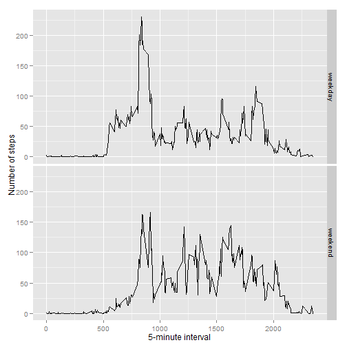

# Peer-graded Assignment: Course Project 1
# Introduction
It is now possible to collect a large amount of data about personal movement using activity monitoring devices such as a Fitbit, Nike Fuelband, or Jawbone Up. These type of devices are part of the “quantified self” movement – a group of enthusiasts who take measurements about themselves regularly to improve their health, to find patterns in their behavior, or because they are tech geeks. But these data remain under-utilized both because the raw data are hard to obtain and there is a lack of statistical methods and software for processing and interpreting the data.

This assignment makes use of data from a personal activity monitoring device. This device collects data at 5 minute intervals through out the day. The data consists of two months of data from an anonymous individual collected during the months of October and November, 2012 and include the number of steps taken in 5 minute intervals each day.

The data for this assignment can be downloaded from the course web site:

Dataset: Activity monitoring data [52K]  
The variables included in this dataset are:

steps: Number of steps taking in a 5-minute interval (missing values are coded as \color{red}{\verb|NA|}NA)
date: The date on which the measurement was taken in YYYY-MM-DD format
interval: Identifier for the 5-minute interval in which measurement was taken
The dataset is stored in a comma-separated-value (CSV) file and there are a total of 17,568 observations in this dataset.

## Loading and preprocessing the data
Unzip data to obtain a csv file. 
unzip(zipfile="activity.zip") 
data <- read.csv("activity.csv")

## What is mean total number of steps taken per day?
library(ggplot2) 
total.steps <- tapply(data$steps, data$date, FUN=sum, na.rm=TRUE) 
qplot(total.steps, binwidth=1000, xlab="total number of steps taken each day") 
median(total.steps, na.rm=TRUE) 1040  
mean(total.steps, na.rm=TRUE) 9350 

# What is the average daily activity pattern?
library(ggplot2) 
averages <- aggregate(x=list(steps=data$steps), by=list(interval=data$interval),FUN=mean, na.rm=TRUE) 
ggplot(data=averages, aes(x=interval, y=steps)) +geom_line(color="blue", size=1) +xlab("Interval") +ylab("Avg. Steps per day") 
averages[which.max(averages$steps),] 
  #max_interval 
       #835 

# Imputing missing values
There are missing valuse. The presence of missing days may introdue bisa into some calculations 
# Replace each missing value with the mean value of its 5-minute interval 
fill.value <- function(steps, interval) { 
    filled <- NA 
    if (!is.na(steps)) 
        filled <- c(steps) 
    else 
        filled <- (averages[averages$interval==interval, "steps"]) 
    return(filled) 
}
filled.data <- data 
filled.data$steps <- mapply(fill.value, filled.data$steps, filled.data$interval) 
total.steps <- tapply(filled.data$steps, filled.data$date, FUN=sum)
qplot(total.steps, binwidth=1000, xlab="total number of steps taken each day")
median(total.steps)
#10760.21
mean(total.steps)
#10760.21

# Are there differences in activity patterns between weekdays and weekends?
weekday.or.weekend <- function(date) { 
    day <- weekdays(date) 
    if (day %in% c("Monday", "Tuesday", "Wednesday", "Thursday", "Friday")) 
        return("weekday") 
    else if (day %in% c("Saturday", "Sunday")) 
        return("weekend") 
    else
        stop("invalid date") 
}
filled.data$date <- as.Date(filled.data$date) 
filled.data$day <- sapply(filled.data$date, FUN=weekday.or.weekend) 

